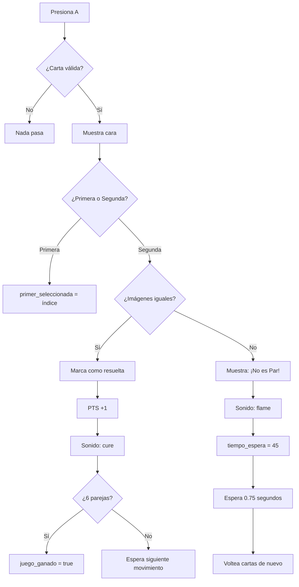

# Explicación del Código del Juego "Memorizar" en Butano para GBA

## 📋 Resumen General

Este es un **juego de memoria (Memory Match)** desarrollado con **Butano**, un framework C++ optimizado para Nintendo Game Boy Advance (GBA). El juego consiste en:
- 12 cartas organizadas en una cuadrícula de 4x3
- 6 parejas de imágenes idénticas
- El jugador debe emparejar todas las cartas antes de ganar
- Controles: flechas direccionales para mover el cursor, botón A para voltear cartas, SELECT para reiniciar

---

## 🎮 Secciones del Código

### 1. **Includes y Dependencias** (Líneas 1-17)

```cpp
#include "bn_core.h"
#include "bn_keypad.h"
#include "bn_random.h"
#include "bn_vector.h"
#include "bn_sprite_ptr.h"
#include "bn_bg_palettes.h"
#include "common_variable_8x16_sprite_font.h"
#include "bn_sprite_text_generator.h"
#include "bn_string.h"
#include "bn_sprite_items_imaback.h"
#include "bn_sprite_items_ima.h"
#include "bn_sprite_items_ima2.h"
#include "bn_sprite_items_ima3.h"
#include "bn_sound_items.h"
```

**Librerías principales de Butano:**
- **`bn_core.h`**: Inicialización y actualización del motor de juego
- **`bn_keypad.h`**: Lectura de entrada de los botones de la GBA
- **`bn_random.h`**: Generador de números aleatorios para mezclar cartas
- **`bn_vector.h`**: Contenedor dinámico optimizado (similar a `std::vector`)
- **`bn_sprite_ptr.h`**: Punteros inteligentes para manejar sprites (imágenes)
- **`bn_bg_palettes.h`**: Gestión de paletas de colores de fondo

**Librerías para texto dinámico:**
- **`common_variable_8x16_sprite_font.h`**: Fuente de 8x16 píxeles para texto
- **`bn_sprite_text_generator.h`**: Generador dinámico de texto basado en sprites
- **`bn_string.h`**: Manejo de cadenas de texto dinámicas

**Assets gráficos precompilados:**
- **`bn_sprite_items_imaback.h`**: Dorso de las cartas
- **`bn_sprite_items_ima.h`**, **`ima2.h`**, **`ima3.h`**: Imágenes frontales de las cartas

**Audio:**
- **`bn_sound_items.h`**: Efectos de sonido (cure.wav, flame.wav)

---

### 2. **Función `obtener_grupo_imagen()`** (Nuevo)

```cpp
int obtener_grupo_imagen(int id) {
    if (id == 1 || id == 4) return 1; // Grupo 'ima'
    if (id == 2 || id == 5) return 2; // Grupo 'ima2'
    if (id == 3 || id == 6) return 3; // Grupo 'ima3'
    return 0;
}
```

Esta función permite agrupar diferentes IDs bajo una misma imagen gráfica. Esto es clave para que el juego detecte un "par" incluso si los IDs técnicos de las cartas son distintos (ej: 1 y 4), siempre que visualmente sean la misma imagen.

---

### 3. **Estructura Carta** (Líneas 15-21)

```cpp
struct Carta {
    int id;              // Identificador (1-6) que determina la pareja
    int x, y;            // Posición en pantalla
    bool descubierta;    // ¿Está boca arriba mostrando su imagen?
    bool resuelta;       // ¿Ya fue emparejada correctamente?
    bn::sprite_ptr sprite; // El gráfico que se dibuja en pantalla
};
```

Cada carta es un objeto con:
- **`id`**: Número del 1 al 6 (dos cartas con el mismo ID forman una pareja)
- **Posición**: Coordenadas X, Y en la pantalla de la GBA
- **Estados**: `descubierta` (está visible) y `resuelta` (fue encontrada)
- **Sprite**: La imagen gráfica que Butano renderiza

---

### 4. **Función `mostrar_cara_carta()`**

```cpp
void mostrar_cara_carta(Carta& carta) {
    int x = carta.x;
    int y = carta.y;
    switch(carta.id) {
        case 1: carta.sprite = bn::sprite_items::ima.create_sprite(x, y); break;
        case 2: carta.sprite = bn::sprite_items::ima2.create_sprite(x, y); break;
        case 3: carta.sprite = bn::sprite_items::ima3.create_sprite(x, y); break;
        case 4: carta.sprite = bn::sprite_items::ima.create_sprite(x, y); break;
        case 5: carta.sprite = bn::sprite_items::ima2.create_sprite(x, y); break;
        case 6: carta.sprite = bn::sprite_items::ima3.create_sprite(x, y); break;
    }
}
```

Esta función:
1. Toma una carta y sus coordenadas
2. Según el `id` (1-6), crea el sprite correspondiente. Nota que los IDs 1 y 4 comparten imagen, al igual que 2-5 y 3-6.
3. Esto "voltea" la carta mostrando su imagen frontal.

---

### 5. **Función Main**

#### A. Inicialización del Sistema
```cpp
bn::core::init();
bn::bg_palettes::set_transparent_color(bn::color(0, 0, 0));
```
- **`bn::core::init()`**: Configura el hardware de la GBA
- **`set_transparent_color()`**: Define el color transparente del fondo (negro)

#### B. Generador de Texto y Puntuación

```cpp
bn::sprite_text_generator text_generator(common::variable_8x16_sprite_font);
text_generator.set_center_alignment();
bn::vector<bn::sprite_ptr, 64> texto_sprites;
bn::vector<bn::sprite_ptr, 16> puntaje_sprites;
bool actualizar_marcador = true;
```

El juego utiliza un **generador de texto dinámico** para mostrar:
- **Mensajes**: "¡No es Par!" y "¡HAS GANADO!" (centrados en pantalla)
- **Puntuación**: "PTS: X/6" en la esquina superior izquierda

Dos vectores separados:
- **`texto_sprites`** (hasta 64): Mensajes temporales
- **`puntaje_sprites`** (hasta 16): Puntuación persistente
- **`actualizar_marcador`** (bool): Bandera que indica si redibujar el marcador

#### C. Matriz de Posiciones y IDs

```cpp
int pos_x[12] = { -60, -20, 20, 60,  -60, -20, 20, 60,  -60, -20, 20, 60 };
int pos_y[12] = { -35, -35, -35, -35,  0, 0, 0, 0,      35, 35, 35, 35 };
int ids[12] = { 1, 1, 2, 2, 3, 3, 4, 4, 5, 5, 6, 6 };
```

- Cuadrícula de **4 columnas × 3 filas**
- Centrada en la pantalla GBA (240×160)
- IDs agrupados: dos cartas con el mismo número forman una pareja

#### D. Inicialización de Variables del Juego

```cpp
int cursor_index = 0;
int primer_seleccionada = -1;
int segundo_seleccionada = -1;
int tiempo_espera = 0;
int frame_count = 0;
int parejas_resueltas = 0;
bool juego_ganado = false;
int tiempo_victoria = 0;
```

| Variable | Valor Inicial | Propósito |
|----------|---------------|----------|
| `cursor_index` | 0 | Índice de la carta bajo el cursor (0-11) |
| `primer_seleccionada` | -1 | Primera carta volteada (-1 = ninguna) |
| `segundo_seleccionada` | -1 | Segunda carta volteada (-1 = ninguna) |
| `tiempo_espera` | 0 | Contador de espera tras error (0-45 frames) |
| `frame_count` | 0 | Contador para efecto de parpadeo (0-15) |
| `parejas_resueltas` | 0 | Parejas encontradas (0-6) |
| `juego_ganado` | false | Flag de victoria |
| `tiempo_victoria` | 0 | Contador para reinicio automático (0-120) |

---

### 6. **Lambda `iniciar_juego()`**

Esta función resetea el tablero completamente. Se ejecuta al inicio y tras cada victoria:

```cpp
auto iniciar_juego = [&]() {
    cartas.clear();
    texto_sprites.clear();
    puntaje_sprites.clear();
    actualizar_marcador = true;

    // Mezclar IDs aleatorios
    int nuevos_ids[12] = { 1, 1, 2, 2, 3, 3, 4, 4, 5, 5, 6, 6 };
    for (int i = 11; i > 0; --i) {
        int j = random.get_int(i + 1);
        int temp = nuevos_ids[i];
        nuevos_ids[i] = nuevos_ids[j];
        nuevos_ids[j] = temp;
    }

    // Crear cartas boca abajo
    for(int i = 0; i < 12; ++i) {
        bn::sprite_ptr sp = bn::sprite_items::imaback.create_sprite(pos_x[i], pos_y[i]);
        cartas.push_back({nuevos_ids[i], pos_x[i], pos_y[i], false, false, sp});
    }

    // Resetear variables
    cursor_index = 0;
    primer_seleccionada = -1;
    segundo_seleccionada = -1;
    tiempo_espera = 0;
    parejas_resueltas = 0;
    tiempo_victoria = 0;
    juego_ganado = false;
};
```

**Qué hace:**
1. **Limpia vectores**: Elimina cartas, mensajes y puntuación anterior
2. **Mezcla cartas**: Usa Fisher-Yates shuffle para orden aleatorio
3. **Crea sprites**: Coloca todas las cartas boca abajo (`imaback`)
4. **Resetea estado**: Vuelve a -1, 0 o false todos los contadores
5. **Activa puntuación**: `actualizar_marcador = true` fuerza redibujado

---

### 7. **Loop Principal del Juego**

El bucle `while(true)` se ejecuta 60 veces por segundo (60 FPS en GBA).

#### **7.0 Reinicio Global (SELECT)**
```cpp
if (bn::keypad::select_pressed()) {
    iniciar_juego();
}
```
Permite reiniciar el juego en cualquier momento presionando SELECT.

#### **7.1 Sistema de Puntuación**

```cpp
if (actualizar_marcador) {
    puntaje_sprites.clear();
    text_generator.set_left_alignment();
    
    bn::string<16> texto_puntaje = "PTS: ";
    texto_puntaje += bn::to_string<4>(parejas_resueltas);
    
    text_generator.generate(-110, -70, texto_puntaje, puntaje_sprites);
    actualizar_marcador = false;
}
```

**Flujo:**
1. Si `actualizar_marcador` es true, genera nuevos sprites de texto
2. Borra los sprites previos para evitar duplicados
3. Crea cadena "PTS: X" donde X es el número de parejas
4. Los sprites se dibujan en la esquina superior izquierda (-110, -70)
5. Se desactiva la bandera hasta el próximo cambio de puntuación

#### **7.2 Condición de Victoria**

```cpp
if (juego_ganado) {
    text_generator.set_center_alignment();
    if (texto_sprites.empty()) {
        text_generator.generate(0, -65, "¡HAS GANADO!", texto_sprites);
    }
    
    for(int i = 0; i < 12; ++i) {
        cartas[i].sprite.set_visible(true);
    }
    
    tiempo_victoria++;
    if (tiempo_victoria >= 120) {  // 2 segundos a 60 FPS
        iniciar_juego();
    }
    
    bn::core::update();
    continue;  // Salta al siguiente frame, ignorando resto del código
}
```

**Qué pasa cuando ganas:**
1. Muestra "¡HAS GANADO!" centrado en pantalla
2. Todas las cartas se vuelven visibles
3. Incrementa contador `tiempo_victoria` cada frame
4. Al alcanzar 120 frames (2 segundos), reinicia automáticamente
5. `continue` evita que se ejecute el resto del loop

#### **7.3 Lógica de Espera Tras Error**

```cpp
if (tiempo_espera > 0) {
    --tiempo_espera;
    if (tiempo_espera == 0) {
        // Voltear las dos cartas incorrectas de nuevo
        cartas[primer_seleccionada].sprite = 
            bn::sprite_items::imaback.create_sprite(...);
        cartas[segundo_seleccionada].sprite = 
            bn::sprite_items::imaback.create_sprite(...);
        
        cartas[primer_seleccionada].descubierta = false;
        cartas[segundo_seleccionada].descubierta = false;
        
        primer_seleccionada = -1;
        segundo_seleccionada = -1;
        texto_sprites.clear();
    }
}
```

**Cronograma de espera:**
- Cuando hay un error, `tiempo_espera = 45` frames
- Cada frame decrementa en 1
- El jugador puede ver ambas cartas durante ~0.75 segundos
- Al llegar a 0, las cartas se voltean y se limpian variables

#### **7.4 Control del Cursor (Movimiento)**

```cpp
if (bn::keypad::left_pressed() && cursor_index % 4 > 0) cursor_index -= 1;
if (bn::keypad::right_pressed() && cursor_index % 4 < 3) cursor_index += 1;
if (bn::keypad::up_pressed() && cursor_index >= 4) cursor_index -= 4;
if (bn::keypad::down_pressed() && cursor_index < 8) cursor_index += 4;
```

**Límites de la cuadrícula 4×3:**
- **Izquierda/Derecha**: `cursor_index % 4` comprueba columna (0-3)
- **Arriba/Abajo**: `cursor_index >= 4` y `cursor_index < 8` previenen saltos fuera de rango

#### **7.5 Selección de Cartas (Botón A)**

```cpp
if (bn::keypad::a_pressed() && !cartas[cursor_index].descubierta && !cartas[cursor_index].resuelta) {
    mostrar_cara_carta(cartas[cursor_index]);
    cartas[cursor_index].descubierta = true;

    if (primer_seleccionada == -1) {
        primer_seleccionada = cursor_index;
    } else {
        segundo_seleccionada = cursor_index;
        
        // Comparación usando grupos de imagen
        if (obtener_grupo_imagen(cartas[primer_seleccionada].id) == 
            obtener_grupo_imagen(cartas[segundo_seleccionada].id)) {
            
            // ACIERTO
            cartas[primer_seleccionada].resuelta = true;
            cartas[segundo_seleccionada].resuelta = true;
            primer_seleccionada = -1;
            segundo_seleccionada = -1;
            
            parejas_resueltas++;
            bn::sound_items::cure.play();  // Sonido de éxito
            actualizar_marcador = true;
            
            if (parejas_resueltas == 6) {
                juego_ganado = true;
            }
        } else {
            // ERROR
            if (texto_sprites.empty()) {
                text_generator.set_center_alignment();
                text_generator.generate(0, -65, "¡No es Par!", texto_sprites);
            }
            bn::sound_items::flame.play();  // Sonido de error
            tiempo_espera = 45;  // 0.75 segundos
        }
    }
}
```

**Flujo de selección:**



**Validaciones:**
- `!cartas[cursor_index].descubierta`: No está ya volteada
- `!cartas[cursor_index].resuelta`: No está en una pareja completada
- `obtener_grupo_imagen()`: Compara por grupo visual, no ID

#### **7.6 Efectos Visuales - Parpadeo del Cursor**

```cpp
for(int i = 0; i < 12; ++i) {
    if(i == cursor_index) {
        cartas[i].sprite.set_visible((frame_count % 16) < 8);
    } else {
        cartas[i].sprite.set_visible(true);
    }
}

frame_count = (frame_count + 1) % 16;
```

**Lógica del parpadeo:**
- `frame_count` oscila entre 0-15 (16 frames = ~0.27 segundos)
- Cuando `frame_count < 8`: la carta bajo el cursor es visible
- Cuando `frame_count >= 8`: la carta bajo el cursor es invisible
- Crea un efecto de parpadeo suave cada ~0.27 segundos

#### **7.7 Actualización del Motor de Juego**

```cpp
bn::core::update();
```

Actualiza la pantalla y procesa todos los cambios de ese frame.

---

## 📊 Variables Importantes

| Variable | Rango | Tipo | Significado |
|----------|-------|------|-------------|
| `cursor_index` | 0-11 | int | Índice de la carta bajo el cursor |
| `primer_seleccionada` | -1 a 11 | int | Índice de la primera carta seleccionada (-1 = ninguna) |
| `segundo_seleccionada` | -1 a 11 | int | Índice de la segunda carta seleccionada (-1 = ninguna) |
| `tiempo_espera` | 0-45 | int | Frames restantes de espera tras error (45 = 0.75s) |
| `frame_count` | 0-15 | int | Contador cíclico para efecto de parpadeo |
| `parejas_resueltas` | 0-6 | int | Número de parejas encontradas |
| `juego_ganado` | true/false | bool | Flag de condición de victoria |
| `tiempo_victoria` | 0-120 | int | Frames desde la victoria (120 = 2s para reinicio) |
| `actualizar_marcador` | true/false | bool | Indica si redibuja "PTS: X" |

---

## 🎨 Imágenes y Gráficos

### Sprites de Cartas

| Elemento | Asset | Ubicación | Uso |
|----------|-------|-----------|-----|
| Dorso | `imaback` | Todas las 12 cartas | Se muestra cuando la carta está boca abajo |
| Frente 1 | `ima` | IDs 1 y 4 | Primera pareja de imágenes |
| Frente 2 | `ima2` | IDs 2 y 5 | Segunda pareja de imágenes |
| Frente 3 | `ima3` | IDs 3 y 6 | Tercera pareja de imágenes |

**Total:** 4 sprites únicos × 12 cartas = 48 instancias en pantalla

### Posicionamiento

```
(-60,-35)  (-20,-35)  (20,-35)  (60,-35)     Fila 1
(-60,  0)  (-20,  0)  (20,  0)  (60,  0)     Fila 2
(-60, 35)  (-20, 35)  (20, 35)  (60, 35)     Fila 3
```

---

## 🔊 Sistema de Sonido

El juego incluye dos efectos de sonido que proporcionan retroalimentación auditiva:

```cpp
bn::sound_items::cure.play();   // Sonido de éxito al encontrar pareja
bn::sound_items::flame.play();  // Sonido de error al fallar pareja
```

| Evento | Sonido | Cuándo |
|--------|--------|--------|
| Pareja Correcta | `cure.wav` | Se reproducen las 6 parejas detectadas |
| Pareja Incorrecta | `flame.wav` | Cada intento fallido |

---

## 🎯 Bucle de Juego Completo (Pseudocódigo)

```
mientras true:
    si SELECT presionado:
        iniciar_juego()
    
    si actualizar_marcador:
        dibujar "PTS: X"
        actualizar_marcador = false
    
    si juego_ganado:
        dibujar "¡HAS GANADO!"
        tiempo_victoria++
        si tiempo_victoria >= 120:
            iniciar_juego()
        continuar al siguiente frame
    
    si tiempo_espera > 0:
        tiempo_espera--
        si tiempo_espera == 0:
            voltear cartas de nuevo
    
    controlar movimiento del cursor (flechas)
    controlar selección (botón A)
    
    si dos cartas seleccionadas:
        si imágenes iguales:
            marcar como resueltas
            PTS++
            sonido: cure
            si PTS == 6:
                juego_ganado = true
        sino:
            mostrar "¡No es Par!"
            sonido: flame
            tiempo_espera = 45
    
    dibujar parpadeo del cursor
    actualizar pantalla (bn::core::update)

---

## ⚙️ Compilación y Ejecución

### Compilación

```bash
make -j16
# Salida:
# - memorizarGBA.gba (ejecutable compilado de ~10-20 KB)
# - memorizar.sav (archivo de configuración/estado de Butano)
```

El flag `-j16` compila con 16 hilos paralelos para mayor velocidad.

### Ejecución

**En Emulador:**
1. Abre tu emulador GBA (mGBA, VBA-M, etc.)
2. Carga `memorizarGBA.gba`
3. Juega

**En GBA Física:**
1. Copia el `.gba` a un flashcart compatible
2. Inserta en la consola GBA
3. Selecciona y ejecuta

---

## 🔧 Optimizaciones Técnicas

### 1. **Vectores Dinámicos Optimizados**
```cpp
bn::vector<Carta, 12> cartas;       // Pre-asignado para 12 elementos
bn::vector<bn::sprite_ptr, 64> texto_sprites;  // Pre-asignado
```
Butano usa vectores con capacidad fija para evitar asignaciones dinámicas frecuentes.

### 2. **Reutilización de Sprites**
- Las 12 cartas comparten solo 4 sprites gráficos (`imaback`, `ima`, `ima2`, `ima3`)
- Esto minimiza el uso de VRAM de la GBA (~32 KB disponibles)

### 3. **Generación Perezosa de Texto**
```cpp
if (texto_sprites.empty()) {
    text_generator.generate(...);
}
```
El texto solo se genera cuando es necesario, no cada frame.

### 4. **Feedback Eficiente**
- Parpadeo: `frame_count % 16` usa operador módulo (muy rápido)
- Sonidos: Se reproducen sin bloquear el juego
- Mensajes: Se limpian y recrean según sea necesario

### 5. **Bandera `actualizar_marcador`**
Evita redibujar el puntuador cada frame. Solo se redibuja cuando:
- Se inicia el juego
- Se encuentra una pareja

---

## 📝 Estructura de Datos

### Struct Carta
```cpp
struct Carta {
    int id;                  // 1-6: determina la pareja
    int x, y;                // Posición: -80 a 80 (X), -80 a 80 (Y)
    bool descubierta;        // ¿Está boca arriba?
    bool resuelta;           // ¿Pareja completada?
    bn::sprite_ptr sprite;   // Referencia al gráfico actual
};
```

**Tamaño aproximado:** ~4 + 4 + 4 + 1 + 1 + 8 = 22 bytes por carta × 12 = 264 bytes total

---

## 🎮 Máquina de Estados del Juego

```
┌─────────────┐
│   INICIO    │
│ (12 cartas  │
│ boca abajo) │
└──────┬──────┘
       │
       ├─────────────────────────────────────┐
       │                                     │
    Presiona A                          Presiona SELECT
       │                                     │
       ▼                                     │
┌──────────────┐                            │
│ SELECCIONANDO│◄────────────────────────────┤
│  CARTAS      │                            │
└──────┬───────┘                            │
       │                                     │
       ├─ Primera carta                      │
       │  (vuelve a esperar)                 │
       │                                     │
       ├─ Segunda carta                      │
       │  ├─ ¿Coinciden?                    │
       │  │  ├─ Sí: marca como resuelta    │
       │  │  │        ¿Ganaste?             │
       │  │  │        ├─ Sí: ir a VICTORIA │
       │  │  │        └─ No: volver a INICIO│
       │  │  │                              │
       │  │  └─ No: espera 0.75s             │
       │  │       voltea de nuevo            │
       │  │       (vuelve a SELECCIONANDO)   │
       │                                     │
       └─────────────────────────────────────┘
            (reinicia cuando gana o
             presiona SELECT)
```

---

## 💾 Persistencia de Datos

El juego **no guarda datos** entre sesiones:
- Cada vez que se ejecuta, comienza desde cero
- Las cartas se mezclan aleatoriamente
- No hay puntuación persistente

Los archivos `.sav` generados por Butano son solo configuración del framework, no datos del juego.

---

## 🚀 Mejoras Futuras Posibles

1. **Sistema de vidas**: Perder vidas por errores
2. **Contador de movimientos**: Mostrar número de intentos
3. **Niveles de dificultad**: 8, 12, 16 cartas
4. **Temporalizador**: Limite de tiempo para resolver
5. **Mejor animación**: Efectos de rotación al voltear
6. **Música de fondo**: Loop musical durante el juego
7. **Guardado de puntuación**: Máxima puntuación en SRAM
8. **Diferentes temas gráficos**: Cambiar imágenes por categoría
